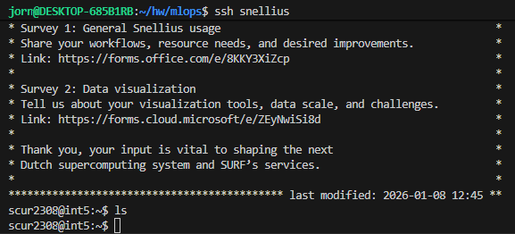

# Assignment 1: Setup & Debugging Journal
**MLOps & ML Programming (2026)**

## Student Information
* **Name:** Jorn Anders Huijbens
* **Student ID:** 15374963
* **TA Name:** Madelon Bernardy
* **GitHub Repository:** https://github.com/JAHuijbens/UvA-mlops
* **Base Skeleton Used:** [https://github.com/SURF-ML/MLOps_2026/tree/main](https://github.com/SURF-ML/MLOps_2026/tree/main)

---

## Question 1: First Contact with Snellius
1. **Connection Details:**
   - **Command:** `ssh snellius`
   - **Login Node:** int5*
   - **** 

2. **Issues Encountered:**
   - **Error Message:** `n/a`
   - **Resolution:** n/a

3. **Smooth Connection (If applicable):**
   - **SSH Client:** OpenSSH_9.6p1 Ubuntu-3ubuntu13.14, OpenSSL 3.0.13 30 Jan 2024
   - **Prior Experience:** using ssh for INF course webtech and work on das5 during DPP
   - **Preemptive Steps:** created an ssh alias for ease of use

---

## Question 2: Environment Setup
1. **Setup Sequence:**
   - **Commands:** 
   ```
   7  module load 2025
   8  module avail python
   9  module load Python/3.13.1-GCCcore-14.2.0
   10  module avail matplotlib
   11  module load matplotlib/3.10.3-gfbf-2025a
   12  python3 -m venv .venv
   13  source .venv/bin/activate
   14  pip3 install torch torchvision --index-url https://download.pytorch.org/whl/cu130
   15  python3
   16  pip3 install packaging
   17  history
   ```
   - **Full Venv Path:** `/home/scur2308/UvA-mlops/.venv`

2. **Pip Install Torch:**
   - **Duration:** 3 min
   - **Warnings:** n/a
   - **Venv Size:** `4.5G`

3. **Mistakes/Unexpected Behavior:**
n/a

4. **Verification:**
   - **Output:** ```
   PyTorch: 2.9.1+cu130
   CUDA available: False
   ```
   - **Explanation:** its expected that CUDA is not available, login node does not have access to a gpu

---

## Question 3: Version Control Setup
1. **GitHub URL:** [\[Link\]](https://github.com/JAHuijbens/UvA-mlops)
2. **Authentication:** SSH + my ssh agent did not want to forward my keys to server, so manually uploaded set of keys to server to auth with github
3. **.gitignore:**
   - **Contents:** 
   ```
   __pycache__/
   *.pyc
   experiments/logs/
   experiments/results/
   .env
   .DS_Store
   *.egg-info/
   ```
   - **Important items to include:** credentials, temporary files, build results, logs etc
   - **README info:** should not include snellius access info, should include how to load dependencies
4. **Git Log:** `839bb48 (HEAD -> main, origin/main) ass1 commit`

---

## Question 4: Your First Batch Job (Slurm)
1. **Files Provided:** [List your .sh, .py, and output.txt files included in zip]
2. **Job ID & Stats:** `[Paste output of sacct command]`
3. **Submission Problem:** [Describe error and diagnosis]
4. **Verification:** [Proof that script ran successfully]
5. **Login vs Batch:** [Explain the difference]
6. **Why Clusters?:** 
---

## Question 5: Reflection & Conceptual Understanding
1. **The Filesystem:**
   - **I/O Performance:** [Why 100k small files are bad]
   - **Mitigation Strategies:** [Strategy 1] and [Strategy 2]
   - **Dataset Versioning:** [How to handle GB/PB datasets]
2. **Reproducibility:** [3 specific causes of different results + MLOps fixes]
3. **Conda vs venv vs uv:** [Pros/Cons of each for Snellius]

---

## Question 6: Package Integrity
1. **ModuleNotFoundError:** [Describe any PYTHONPATH or __init__.py issues]
2. **Import Abstraction:** [Why import from ml_core.data vs ml_core.data.pcam?]
3. **Pytest Result:** `[Paste output of pytest tests/test_imports.py]`

---

## Question 7: The Data Pipeline
1. **Implementation:** `[Paste __getitem__ method]`
2. **Local Pytest:** `[Paste output of pytest tests/test_pcam_pipeline.py]`
3. **CI Pipeline:**
   - **Screenshot:** 
   - **Reflection:** [CI vs Local discrepancies]
4. **Sampling Math:** [Average positives with vs without WeightedRandomSampler]
5. **EDA Plots:**
   - 
   - [Additional plots as requested]

---

## Question 8: Model Implementation (MLP)
1. **Forward Pass:** [Error details + dimension calculation for (3, 96, 96)]
2. **Weight Updates:** [Why check backprop explicitly?]
3. **Test Output:** `[Paste output of pytest on the relevant file]`

---

## Question 9: Training Loop & Loss Visualization
1. **Training Execution:** [Method used + Node ID (gcnXX)]
2. **Loss Visualization:**
   - **Plot:** 
   - **Trajectory Analysis:** [Healthy curve? Trajectory hypothesis?]
3. **Most Frustrating Error:**
   - **Error Message:** `[Traceback]`
   - **Debugging Steps:** [How you resolved it]

---

## Final Submission Checklist
- [ ] Folder contains .md file and assets/ folder?
- [ ] Name and Student ID on page 1?
- [ ] All code/terminal snippets are in backtick blocks?
- [ ] All images use relative paths (e.g., assets/pcam.png)?
- [ ] Slurm .sh and .out files included in the .zip?